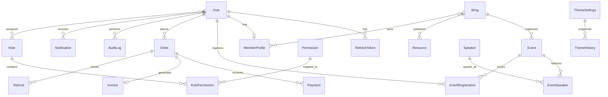
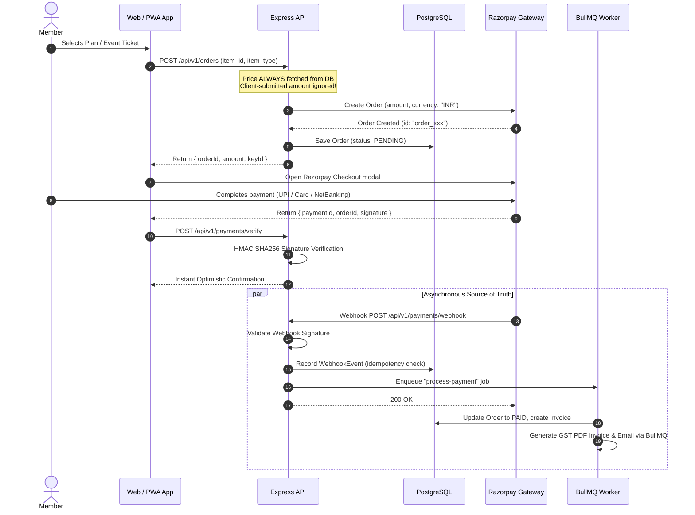

# ASCEND CA Community — System Architecture Document

## 1. System Overview

**ASCEND CA Community** is a high-performance, Pan-India digital community platform for Chartered Accountants, corporate finance leaders, and students. The platform consists of four unified experiences served by a monorepo architecture:

1. **Public Website (`apps/web`)**: High-performance, SEO-optimized public portal built with Next.js App Router (SSR/SSG). Features rich presentation of 10 professional wings, upcoming summits, speakers, publications/news, resource library, and interactive road-to-launch growth charts.
2. **Member Portal (`apps/web`)**: Integrated authentication and member-only area for registered Chartered Accountants and allied professionals. Features ICAI verification workflows, member profiles, event RSVPs, ticket bookings, invoice receipts, and personalized calendar.
3. **Admin Panel (`apps/admin`)**: A physically isolated application deployed on a separate subdomain (`admin.<domain>`), protected behind network policies (Cloudflare Zero Trust / IP allowlist), mandatory TOTP 2FA, short-lived sessions, and sensitive-action re-authentication.
4. **Mobile PWA**: Installable progressive web application with offline support, service worker caching, dynamic manifest styling linked to the live theme, and web push notifications.

---

## 2. Monorepo Structure & Workspaces

The codebase is organized as an npm workspaces monorepo:

```
ca-community/
├── apps/
│   ├── api/                    # Express.js REST API + Prisma + BullMQ (Composition Root)
│   ├── web/                    # Next.js App Router: Public Website + Member Portal + PWA
│   └── admin/                  # Next.js App Router: Isolated Admin Backoffice (Port 3001)
├── packages/
│   ├── shared/                 # Shared Zod schemas, DTOs, RBAC definitions, OpenAPI builder
│   └── ui/                     # Design-token-driven component library (CVA + Tailwind)
├── .nvmrc                      # Node 20.18.0 pinned
├── package.json                # Root workspace configuration (npm workspaces)
├── tsconfig.base.json          # Shared strict TypeScript configuration
└── ARCHITECTURE.md             # This document
```

### Dependency Graph & Workspaces
- `packages/shared`: Pure TypeScript. Exports Zod schemas, constants, type definitions, and OpenAPI contract generator. Zero runtime browser/node-specific dependencies.
- `packages/ui`: Depends on `@ascend/shared`, Tailwind CSS, Class Variance Authority (`cva`), and Lucide/SVG icon definitions. Reads semantic CSS variables.
- `apps/api`: Depends on `@ascend/shared`, Express, Prisma Client, Redis/IORedis, BullMQ, Argon2, Jose/JWT, Otplib.
- `apps/web`: Depends on `@ascend/shared`, `@ascend/ui`, Next.js 15, TanStack Query, React Hook Form, Serwist (PWA).
- `apps/admin`: Depends on `@ascend/shared`, `@ascend/ui`, Next.js 15, TanStack Query, React Hook Form.

---

## 3. Database Architecture & ERD

The data layer uses **PostgreSQL** managed by **Prisma ORM**.



### Core Entity Definitions:
1. **Users & Authentication**:
   - `User`: Identity root with Argon2id password hash, role enum (`SUPER_ADMIN`, `ADMIN`, `MODERATOR`, `MEMBER`, `GUEST`), 2FA secret/status, lockout counters, and soft-delete support.
   - `RefreshToken`: Stored hashed with family tracking for rotation and reuse detection.
   - `MemberProfile`: Encrypted ICAI number (AES-256-GCM), phone, firm name, city, qualification year, status (`PENDING_VERIFICATION`, `ACTIVE`, `SUSPENDED`).
2. **Community & Content**:
   - `Wing`: 10 foundational wings (e.g., Tax & Regulatory, Audit & Assurance, AI & Technology, Practice Growth) with brand color, tags, monthly activities.
   - `Speaker`: Profile, designations, bio, avatar, social handles.
   - `Event`: Summit/Workshop/Seminar/Clinic with offline/online format, venue, tiered pricing (Standard vs. Member discount), seat caps, registration counts.
   - `EventRegistration`: Booking ID (`ASC27-XXX-XXXX`), QR hash, check-in status, attendee metadata.
   - `Resource`: Guides, spreadsheets, prompt libraries, templates.
   - `News`: Editorial news items, launch announcements, category tags.
   - `ContentBlock`: Key-value CMS store for copy, headings, vision, principles, legal terms.
3. **Financials & GST Compliance**:
   - `Order`: Server-computed pricing, line items JSONB, currency (INR), status.
   - `Payment`: Gateway transaction (`pay_xxx`), method (UPI, Card, NetBanking), signature verified.
   - `Refund`: Gateway refund ID, amount, reason, initiated by admin ID.
   - `Invoice`: Financial year invoice number (`ASC/26-27/0001`), HSN/SAC code `998399`, SGST/CGST/IGST breakdown, customer GSTIN, PDF storage path.
   - `WebhookEvent`: Idempotency tracking table storing raw webhook payload, hash, and status.
4. **Governance & Theming**:
   - `ThemeSettings`: Dynamic tokens JSONB (palette, typography, borders, shadows) for WEB and MOBILE platforms.
   - `AuditLog`: Immutable record of every administrative modification (actor, action, resource, IP, user-agent, diff JSONB).

---

## 4. Role-Based Access Control (RBAC) & Security Architecture

### Permission Matrix

| Permission | SUPER_ADMIN | ADMIN | MODERATOR | MEMBER | GUEST |
|---|:---:|:---:|:---:|:---:|:---:|
| `members:read` | Yes | Yes | Yes | Directory Only | No |
| `members:approve` | Yes | Yes | No | No | No |
| `members:suspend` | Yes | Yes | No | No | No |
| `events:create` | Yes | Yes | No | No | No |
| `events:update` | Yes | Yes | Yes | No | No |
| `events:rsvp` | Yes | Yes | Yes | Yes | Yes (Paid) |
| `content:edit` | Yes | Yes | Yes | No | No |
| `content:publish` | Yes | Yes | No | No | No |
| `payments:view` | Yes | Yes | No | Self Only | Self Only |
| `payments:refund` | Yes | Re-auth required | No | No | No |
| `theme:update` | Yes | Yes | No | No | No |
| `theme:publish` | Yes | Re-auth required | No | No | No |
| `audit:read` | Yes | Yes | No | No | No |
| `roles:manage` | Yes | Re-auth required | No | No | No |

### Security Isolation Model
1. **Public/Member Web Bundle Isolation**:
   - The member web client bundle contains ZERO admin routes, ZERO admin API URLs, and no administrative component definitions.
   - Web member login strictly accepts `MEMBER` and `GUEST` accounts. Any attempt to authenticate an administrative role returns a generic invalid credentials message.
2. **Admin Application Isolation**:
   - Deployed on `admin.ascend-ca.in` with HTTP response headers: `X-Robots-Tag: noindex, nofollow`, `Content-Security-Policy`, and strict CORS headers allowing only the admin origin.
   - Admin API router is mounted under `/admin-api` **only** when `ADMIN_API_ENABLED=true`.
   - Distinct JWT audience: `ascend-web` vs. `ascend-admin`. Tokens cannot be exchanged or accepted across boundaries.
   - Dedicated cookie names: `__Host-ascend_member_sess` vs. `__Host-ascend_admin_sess`.
   - Admin sessions require verified TOTP 2FA. Critical actions (refunds, role elevation, theme publishing) mandate re-authentication (sudo mode) within 5 minutes.
3. **Data Protection & Encryption**:
   - Sensitive PII (phone number, ICAI membership ID) is encrypted at rest using AES-256-GCM with keys managed in environment/secret managers.
   - Passwords hashed with Argon2id ($v=19, m=65536, t=3, p=4$).

---

## 5. Payments Architecture (Razorpay Integration)



---

## 6. Dynamic Theming Engine

The platform implements a real-time, database-backed design token system:
- **Design Tokens**: Defined in `packages/shared` as a strict JSON schema covering semantic CSS variables:
  `--bg`, `--card`, `--fg`, `--muted`, `--faint`, `--line`, `--soft`, `--lime`, `--cobalt`, `--navy`, `--sky`, `--font-sans`, `--font-display`, `--font-serif`, `--font-mono`, `--radius`.
- **Default Prototype Palette**:
  - Dark base: `#03050F` (`--bg`)
  - Surface/Card: `#0A1130` (`--card`)
  - Foreground text: `#E8EFF8` (`--fg`)
  - Accent / Lime-cobalt primary: `#2F5BFF` (`--lime`)
  - Border line: `rgba(219,231,240,.09)` (`--line`)
  - Display Font: `Inter Tight`
  - Serif Accent: `Instrument Serif`
  - Monospace: `Geist Mono`
- **SSR Injection**: Next.js App Router fetches the published theme from `/api/theme` (cached in Redis) in the root layout and outputs a server-rendered `<style id="ascend-theme">` block before any HTML renders, preventing any FOUC (Flash of Unstyled Content).
- **Admin Control**: Live preview in `apps/admin`, WCAG AA contrast ratio validation (> 4.5:1), instant Redis cache invalidation on publish.

---

## 7. API Architecture & Composition Root

The backend in `apps/api` follows strict architectural layering:
- **Routes**: Expose HTTP endpoints, attach middleware (`validate`, `authenticate`, `requirePermission`, `rateLimiter`).
- **Controllers**: Parse typed DTOs from requests and map service results to standard `ApiResponse<T>`.
- **Services**: Pure business logic, authorization invariants, domain events.
- **Repositories**: All Prisma queries, transactions, and persistence concerns.
- **Composition Root (`src/container.ts`)**: Initializes database pools, Redis clients, email adapters, repositories, services, and controllers with manual dependency injection. Zero global singletons.
